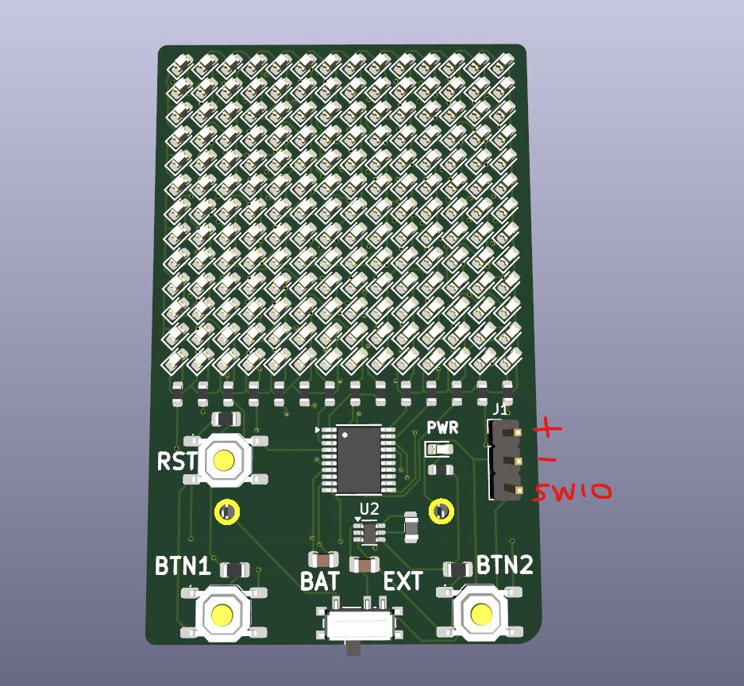

# ch32_hackathon_badge_hw

This repo contains all hardware files needed to produce the 2025 hackathon badge.

## Programming

Attach a minichlink with +, - and SWIO to the pin header

## Revision A

This is the initially produced pcb marked on the back with serial numbers from #00 up to #36.

It needs to be run on two button cells stacked on each other ( = in series)

## Revision B

Not yet produced.

Bugfixes:

- improved layout to hopefully work on a single button cell
  - big thank you to [prozessorkern](https://github.com/prozessorkern/)
